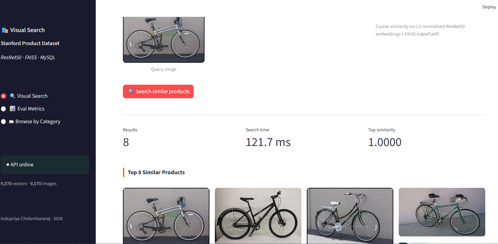
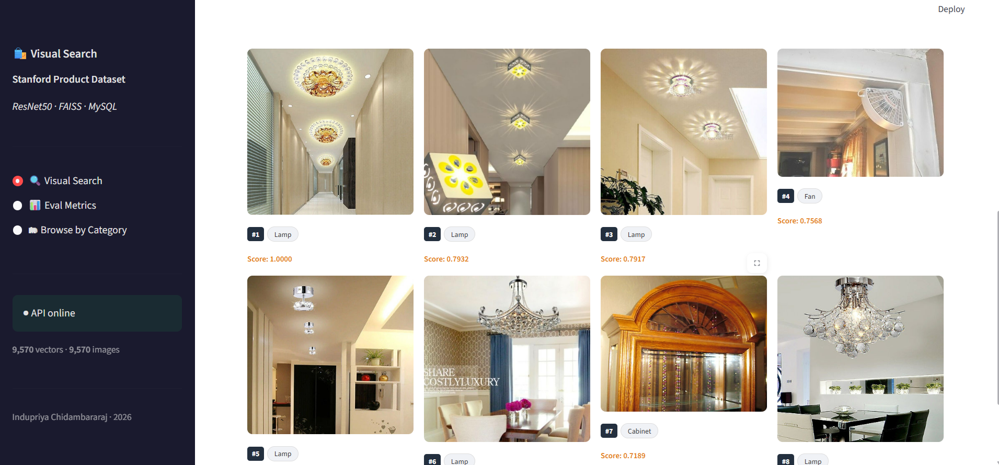
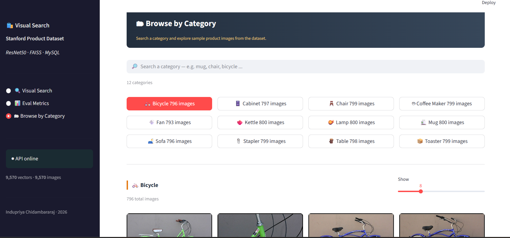
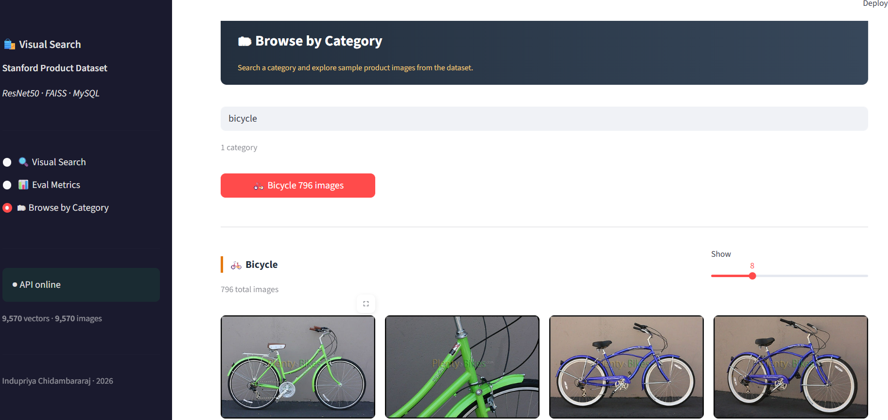
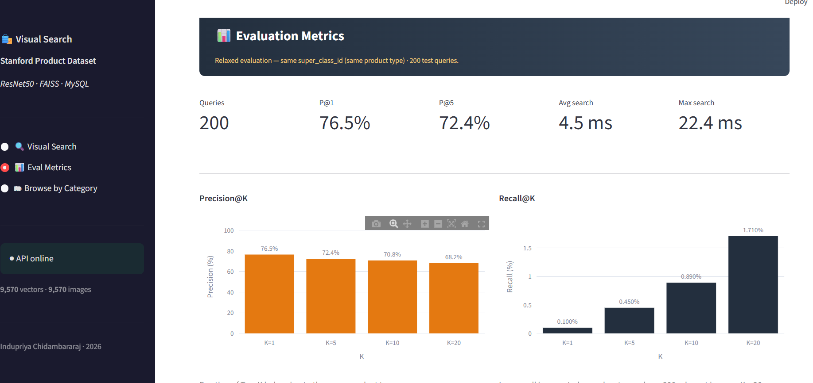
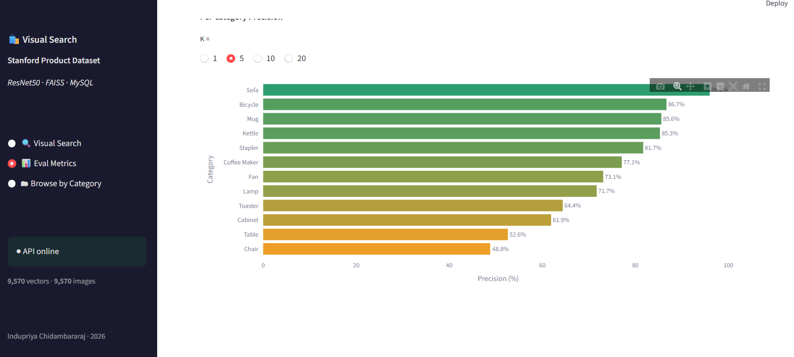

# 🔍 SnapMatch — Image-Based Product Retrieval System

> **Upload any product photo and instantly find visually similar items — powered by deep visual embeddings, FAISS vector search, and a two-pass data cleaning pipeline.**

[](https://www.python.org/)
[](https://pytorch.org/)
[](https://github.com/facebookresearch/faiss)
[](https://streamlit.io/)
[](https://www.mysql.com/)

---

## 📌 Overview

This project implements a **content-based image retrieval (CBIR) system** that lets users upload a product photo and instantly find visually similar products from a catalogue of **9,570 images** across 12 product categories.

The system extracts deep visual features using a pre-trained **ResNet50** backbone, builds an **L2-normalised FAISS index** for fast cosine similarity search, and surfaces results through a clean multi-page **Streamlit UI** — all backed by a **MySQL** metadata store.

---

## ✨ Key Features

| Feature | Detail |
|---|---|
| 🧠 **Feature Extraction** | ResNet50 (ImageNet pre-trained), global average pooled 2048-d embeddings |
| ⚡ **Vector Search** | FAISS `IndexFlatIP` — cosine similarity via L2-normalised vectors |
| 🗄️ **Metadata Store** | MySQL — category labels, image paths, product IDs |
| 🧹 **Data Cleaning** | 2-pass pipeline: 6 structural checks + semantic outlier removal via cosine similarity to category centroid |
| 🌐 **Web Interface** | 3-page Streamlit app: Visual Search · Eval Metrics · Browse by Category |
| 📊 **Evaluation** | Precision@K and Recall@K over 200 test queries (relaxed: same `super_class_id`) |
| 🏷️ **12 Categories** | Bicycle · Cabinet · Chair · Coffee Maker · Fan · Kettle · Lamp · Mug · Sofa · Stapler · Table · Toaster |

---

## 🎬 Demo

> **Note:** GitHub cannot play videos directly from the `assets/` folder in a README.
> Upload your video via a GitHub Issue (drag & drop into the text box), copy the generated link, and replace the line below.

[`https://github.com/indupriya03/SnapMatch/assets/YOUR-ID/YOUR-VIDEO-ID.mp4`](https://github.com/user-attachments/assets/e92ca6d5-f2b3-410b-9596-7f5f5abf65e2)

*Video file is stored at `assets/demo.mp4` in this repository.*

---

## 🖼️ Application Screenshots

### 🔎 Visual Search — Query & Results
Upload a product image, click **Search similar products**, and get the top-K nearest neighbours ranked by cosine similarity — with category label, rank, and similarity score.

> *Query: bicycle → Top-1 similarity: 1.0000 · 8 results returned · Search time: 121.7 ms*



---

### 🪔 Visual Search — Lamp Query
The system correctly retrieves visually similar lamp styles. Result #7 (Cabinet) is a genuine boundary case where visual texture overlaps categories — reflecting a real-world retrieval challenge, not a system failure.



---

### 📂 Browse by Category
Explore all 12 product categories. Select a category to browse sample images from the dataset with a configurable result count slider.




---

### 📊 Evaluation Metrics
The Eval Metrics page reports aggregate retrieval quality and per-category precision across K = 1, 5, 10, 20 — over 200 held-out test queries.




---

## 📈 Results

### Aggregate Metrics — 200 test queries, relaxed evaluation (same `super_class_id`)

| Metric | Plain meaning | Value |
|---|---|---|
| **Top-1 Accuracy** | Is the #1 result the correct product type? | 76.5% |
| **Top-5 Precision** | Among the first 5 results, how many are correct? | 72.4% |
| **Top-10 Precision** | Among the first 10 results, how many are correct? | 70.8% |
| **Top-20 Precision** | Among the first 20 results, how many are correct? | 68.2% |
| **Avg search time** | Time to find matches per query | 4.5 ms |
| **Max search time** | Worst-case search latency | 22.4 ms |

### Per-Category Precision@5

| Category | Precision@5 |
|---|---|
| Sofa | ~97% |
| Bicycle | 86.7% |
| Mug | 85.6% |
| Kettle | 85.3% |
| Stapler | 81.7% |
| Coffee Maker | 77.1% |
| Fan | 73.1% |
| Lamp | 71.7% |
| Toaster | 64.4% |
| Cabinet | 61.9% |
| Table | 52.6% |
| Chair | 48.8% |

> **Observation:** Visually distinctive, structured objects (sofa, bicycle, mug) retrieve with very high precision. Flat-surface categories like Chair and Table show lower precision due to high within-class visual variance — a known challenge in product retrieval that metric learning fine-tuning would address.

---

## 🏗️ End-to-End Pipeline

A fully structured, script-driven pipeline — every stage has a dedicated module, outputs feed cleanly into the next step.

```
┌─────────────────────────────────────────────────────────────────┐
│                        OFFLINE PIPELINE                         │
│                   (run once to build the index)                 │
├─────────────────────────────────────────────────────────────────┤
│                                                                 │
│  Step 1 │ download_data.py                                      │
│         │ Download Stanford Product Dataset → data/             │
│         │                                                       │
│  Step 2 │ clean_data.py  ── Pass 1: Structural Cleaning         │
│         │ 6 checks per image:                                   │
│         │ corrupt · format · size · RGB · blank · duplicate     │
│         │ Output → data/cleaned_data/ + cleaning_report.json    │
│         │                                                       │
│  Step 3 │ embeddings.py  ── Pass 1                              │
│         │ ResNet50 → Global Avg Pool → 2048-d vectors           │
│         │ Output → outputs/embeddings.npy + image_paths.json    │
│         │                                                       │
│  Step 4 │ clean_data.py  ── Pass 2: Semantic Noise Detection    │
│         │ Cosine sim to category centroid < 0.50 → removed      │
│         │ Output → noise_report.json                            │
│         │                                                       │
│  Step 5 │ embeddings.py  ── Pass 2                              │
│         │ Re-extract on fully cleaned image set                 │
│         │ Output → outputs/embeddings.npy (final)               │
│         │                                                       │
│  Step 6 │ build_index.py                                        │
│         │ L2-normalise → FAISS IndexFlatIP → outputs/faiss.index│
│         │                                                       │
│  Step 7 │ build_metadata.py                                     │
│         │ Populate MySQL: image paths · category labels         │
│         │                                                       │
│  Step 8 │ evaluate.py                                           │
│         │ 200 test queries → Precision@K · Recall@K report      │
│                                                                 │
└─────────────────────────────────────────────────────────────────┘

┌─────────────────────────────────────────────────────────────────┐
│                       ONLINE PIPELINE                           │
│                    (live at query time)                         │
├─────────────────────────────────────────────────────────────────┤
│                                                                 │
│  User uploads query image via Streamlit                         │
│         │                                                       │
│         ▼                                                       │
│  ResNet50 → 2048-d embedding → L2 normalise                     │
│         │                                                       │
│         ▼                                                       │
│  FAISS IndexFlatIP — inner product search (≡ cosine sim)        │
│  Returns Top-K image IDs + similarity scores  (~4.5 ms avg)     │
│         │                                                       │
│         ▼                                                       │
│  MySQL lookup — category label · image path · metadata          │
│         │                                                       │
│         ▼                                                       │
│  Streamlit UI — ranked grid with rank · category · score        │
│                                                                 │
└─────────────────────────────────────────────────────────────────┘
```

---

## 🧹 Data Cleaning Pipeline

A custom two-pass pipeline ensures only high-quality, semantically coherent images enter the FAISS index.

### Pass 1 — Structural Cleaning (pixel-level)

| Check | Condition | Action |
|---|---|---|
| Corrupt | PIL verify fails | Remove |
| Format | Not JPEG or PNG | Remove |
| Size | Width or height < 50px | Remove |
| Channel | Not RGB | Remove |
| Blank | Pixel std < 2.0 | Remove |
| Duplicate | MD5 perceptual hash collision (16×16 resize) | Remove |

Clean images are copied to `cleaned_data/`. A full JSON report is saved per run.

### Pass 2 — Semantic Noise Detection (embedding-level)

For each category:
1. Compute the **L2-normalised centroid** of all embeddings in that category
2. Compute **cosine similarity** of every image to its category centroid
3. Flag and remove images below **0.50** — mislabelled or visually incoherent images

```
cosine_sim(image_embedding, category_centroid) < 0.50  →  semantic outlier → removed
```

Embeddings are re-extracted after Pass 2 so the final FAISS index is built only on clean data.

---

## 🗂️ Dataset

**Stanford Online Products Dataset**
- 9,570 images (subset used for indexing)
- 12 product `super_class` categories
- Source: [Kaggle — Stanford Online Products Dataset](https://www.kaggle.com/datasets/liucong12601/stanford-online-products-dataset)

---

## 🛠️ Tech Stack

- **Deep Learning:** PyTorch · torchvision · ResNet50
- **Vector Search:** FAISS (`IndexFlatIP`)
- **Database:** MySQL
- **Frontend:** Streamlit · Plotly
- **Language:** Python 3.10+

---

## 🚀 Setup & Run

```bash
# 1. Clone the repository
git clone https://github.com/indupriya03/SnapMatch.git
cd SnapMatch

# 2. Install dependencies
pip install -r requirements.txt

# 3. Configure MySQL
#    Edit .env with your MySQL credentials and dataset path

# 4. Run the full offline pipeline
python pipeline.py

# 5. Launch the Streamlit app
streamlit run app.py
```

---

## 📁 Project Structure

```
SnapMatch/
├── app.py                      # Streamlit application entry point
├── pipeline.py                 # End-to-end pipeline orchestration
├── .env                        # MySQL credentials & config
├── requirements.txt
├── README.md
├── assets/                     # Screenshots & demo video
├── api/
│   └── search.py               # Visual Search · Eval Metrics · Browse by Category pages
├── db/
│   ├── database.py             # MySQL connection & session management
│   ├── models.py               # ORM / data models
│   └── queries.py              # SQL queries & retrieval logic
├── src/
│   ├── download_data.py        # Step 1 — dataset download
│   ├── clean_data.py           # Step 2 & 4 — two-pass data cleaning
│   ├── embeddings.py           # Step 3 & 5 — ResNet50 feature extraction
│   ├── build_index.py          # Step 6 — FAISS index creation
│   ├── build_metadata.py       # Step 7 — MySQL metadata population
│   ├── evaluate.py             # Step 8 — Precision@K / Recall@K evaluation
│   └── searcher.py             # Online search logic
├── outputs/                    # FAISS index · embeddings · evaluation reports
└── data/                       # Raw & cleaned image data
```

---

## 🔮 Future Work

- [ ] Swap `IndexFlatIP` for `IndexIVFPQ` for million-scale scalability
- [ ] Replace ResNet50 with CLIP image encoder for zero-shot cross-modal retrieval
- [ ] Containerise with Docker; expose search as a REST API (FastAPI)

---

## 👩‍💻 Author

**Indupriya Chidambararaj** · 2026
Machine Learning Engineer & Data Scientist
[GitHub](https://github.com/indupriya03) · [LinkedIn](https://www.linkedin.com/in/indupriyachidambararaj/)

---

*Built with PyTorch · FAISS · MySQL · Streamlit*
